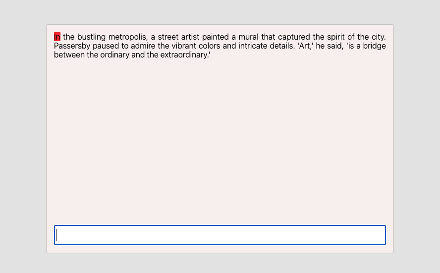
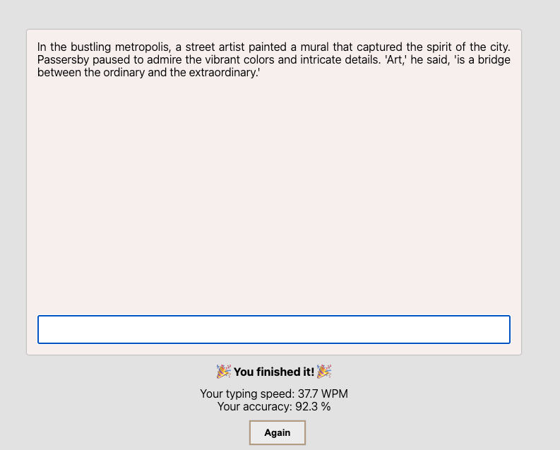

# Type

A simple web app built with HTML, CSS, and JavaScript that measures typing speed (WPM) and accuracy. The text turns green as you type correctly, while mistakes are highlighted in red and must be fixed to continue. Each refresh loads a new random passage for practice. Reset the typing after every 10 sec of inactivity. Responsive design ensures it works on different devices.

## Screenshots

